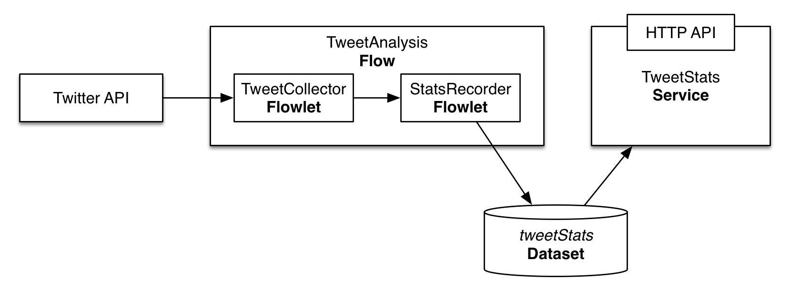

Consuming Twitter Data in Realtime
==================================

Consuming a live tweets stream in realtime is one of the common tasks
of big data applications that power the social analytics. In this guide,
you will learn how to accomplish it with the Cask Data Application Platform
([CDAP](http://cdap.io)).

What You Will Build
-------------------

You will build a CDAP application that consumes data from the public
Twitter feed and computes the average tweet size. You will:

- Build a a realtime 
  [Flow](http://docs.cdap.io/cdap/current/en/developer-guide/building-blocks/flows-flowlets/flows.html)
  to process tweets in realtime;
- Use a Flowlet from the [cdap-pack-twitter](https://github.com/caskdata/cdap-packs) library that
  uses the [Twitter4j](http://twitter4j.org/) library to connect the Flow and
  Twitter stream;
- Use a 
  [Dataset](http://docs.cdap.io/cdap/current/en/developer-guide/building-blocks/datasets/index.html)
  to persist the results of the analysis; and
- Build a 
  [Service](http://docs.cdap.io/cdap/current/en/developer-guide/building-blocks/services.html)
  to serve the analysis results via a RESTful endpoint.

What You Will Need
------------------

- [JDK 6 or JDK 7](http://www.oracle.com/technetwork/java/javase/downloads/index.html)
- [Apache Maven 3.0+](http://maven.apache.org/)
- [CDAP SDK](http://docs.cdap.io/cdap/current/en/developer-guide/getting-started/standalone/index.html)

Let’s Build It!
---------------

Following sections will guide you through building an application from
scratch. If you are interested in deploying and running the application
right away, you can clone its source code from this GitHub repository.
In that case, feel free to skip the next two sections and jump right to
the [Configuring TweetCollectorFlowlet]() section.

### Application Design

Realtime processing capability within CDAP is supported by a Flow. The
application we are building in this guide uses a Flow for processing the
tweets consumed from Twitter feed. The processing results are persisted
in a Dataset and are made available via RESTful endpoint using a
Service.



The Flow consists of two processing nodes called Flowlets:

-   A collector Flowlet that consumes data from Twitter feed and output
    a synthesized Tweet object; and
-   An analyzer Flowlet that consumes the tweet emitted by the collector
    to update the basic statistics of Tweets: total tweets size and
    count.

### Application Implementation

The recommended way to build a CDAP application from scratch is to use a
Maven project. Use the following directory structure (you’ll find
contents of these files described below):

    ./pom.xml
    ./src/main/java/co/cask/cdap/guides/twitter/TwitterAnalysisApp.java
    ./src/main/java/co/cask/cdap/guides/twitter/TweetAnalysisFlow.java
    ./src/main/java/co/cask/cdap/guides/twitter/StatsRecorderFlowlet.java
    ./src/main/java/co/cask/cdap/guides/twitter/TweetStatsHandler.java
    ./src/main/resources/twitter4j.properties

The application will use the `cdap-packs-twitter` library which includes an
implementation of `TweetCollectorFlowlet`. You'll need to add this
library as a dependency to your project's pom.xml:

```xml
...
<dependencies>
  ...
  <dependency>
    <groupId>co.cask.cdap.packs</groupId>
    <artifactId>cdap-twitter-pack</artifactId>
    <version>0.1.0</version>
  </dependency>
</dependencies>
```

Create the `TwitterAnalysisApp` class which declares that the application
has a Flow, a Service, and creates a Dataset:

```java
public class TwitterAnalysisApp extends AbstractApplication {
  static final String NAME = "TwitterAnalysis";
  static final String TABLE_NAME = "tweetStats";
  static final String SERVICE_NAME = "TweetStats";

  @Override
  public void configure() {
    setName(NAME);
    createDataset(TABLE_NAME, KeyValueTable.class);
    addFlow(new AnalysisFlow());
    addService(SERVICE_NAME, new TweetStatsHandler());
  }
}
```

The `TweetAnalysisFlow` makes use of the `TweetCollectorFlowlet` that is
available in the `cdap-packs-twitter` library:

```java
public class TweetAnalysisFlow implements Flow {
  static final String NAME = "TweetAnalysisFlow";
  @Override
  public FlowSpecification configure() {
    return FlowSpecification.Builder.with()
      .setName(NAME)
      .setDescription("Collects simple tweet stats")
      .withFlowlets()
        .add("collect", new TweetCollectorFlowlet())
        .add("recordStats", new StatsRecorderFlowlet())
      .connect()
        .from("collect").to("recordStats")
      .build();
  }
}
```

Tweets pulled by the `TweetCollectorFlowlet` are consumed by the
`StatsRecorderFlowlet` that updates the total number of tweets and their
total body size in a Dataset:

```java
public class StatsRecorderFlowlet extends AbstractFlowlet {
  @UseDataSet(TwitterAnalysisApp.TABLE_NAME)
  private KeyValueTable statsTable;

  @ProcessInput
  public void process(Tweet tweet) {
    statsTable.increment(Bytes.toBytes("totalCount"), 1);
    statsTable.increment(Bytes.toBytes("totalSize"), tweet.getText().length());
  }
}
```

In a real-world scenario, the Flowlet could perform more sophisticated
processing on tweets.

Finally, the `TweetStatsHandler` uses the `tweetStats` Dataset to compute the
average tweet size and serve it over HTTP:

```java
@Path("/v1")
public class TweetStatsHandler extends AbstractHttpServiceHandler {

  @UseDataSet(TwitterAnalysisApp.TABLE_NAME)
  private KeyValueTable statsTable;

  @Path("avgSize")
  @GET
  public void sentimentAggregates(HttpServiceRequest request, HttpServiceResponder responder) throws Exception {
    long totalCount = statsTable.incrementAndGet(Bytes.toBytes("totalCount"), 0);
    long totalSize = statsTable.incrementAndGet(Bytes.toBytes("totalSize"), 0);
    responder.sendJson(totalCount > 0 ? totalSize / totalCount : 0);
  }
}
```

### Configuring `TweetCollectorFlowlet`

In order to utilize the `TweetCollectorFlowlet`, a Twitter API key and
Access token must be obtained and configured. Follow the steps provided
by Twitter to obtain [OAuth access
tokens.](https://dev.twitter.com/oauth/overview/application-owner-access-tokens)
You can provide these to the `TweetCollectorFlowlet` as runtime arguments of
the Flow or put them in `twitter4j.properties` in the
`src/main/resources/` directory and package it with the application. The
format of the `twitter4j.properties` file:

```console
oauth.consumerKey=***************************
oauth.consumerSecret=***************************
oauth.accessToken=***************************
oauth.accessTokenSecret=***************************
```

Build & Run
-----------

The TwitterAnalysisApp application can be built and packaged using the Apache Maven command:

    mvn clean package

Note that the remaining commands assume that the `cdap-cli.sh` script is
available on your PATH. If this is not the case, please add it:

    export PATH=$PATH:<CDAP home>/bin

If you haven't already started a standalone CDAP installation, start it with the command:

    cdap.sh start

We can then deploy the application to a standalone CDAP installation and
start its components:

    cdap-cli.sh deploy app target/cdap-twitter-ingest-guide-1.0.0.jar
    cdap-cli.sh start flow TwitterAnalysis.TweetAnalysisFlow
    cdap-cli.sh start service TwitterAnalysis.TweetStatsService

Once Flow is started, tweets are pulled and processed. You can query for
the average tweet size:

    curl http://localhost:10000/v2/apps/TwitterAnalysis/services/TweetStatsService/methods/v1/avgSize

Example output:

    132

Related Topics
--------------

- TwitterSentiment [tutorial](https://github.com/caskdata/cdap-apps).

Share and Discuss!
------------------

Have a question? Discuss at the [CDAP User Mailing List.](https://groups.google.com/forum/#!forum/cdap-user)

License
-------

Copyright © 2014 Cask Data, Inc.

Licensed under the Apache License, Version 2.0 (the "License"); you may
not use this file except in compliance with the License. You may obtain
a copy of the License at

http://www.apache.org/licenses/LICENSE-2.0

Unless required by applicable law or agreed to in writing, software
distributed under the License is distributed on an "AS IS" BASIS,
WITHOUT WARRANTIES OR CONDITIONS OF ANY KIND, either express or implied.
See the License for the specific language governing permissions and
limitations under the License.

