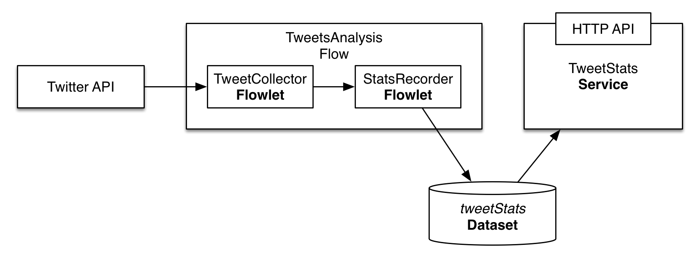

Consuming Twitter Data in Real-time
======================

Consuming live tweets stream in real-time is one of the common tasks of big data applications that power the social 
analytics. In this guide you will learn how to accomplish it with Cask Data Application Platform (CDAP_).

What You Will Build
-------------------

You will build a CDAP application that consumes data from the public twitter feed and computes tweet average size. 
You will:

* Build a a realtime `Flow <http://docs.cask.co/cdap/current/en/dev-guide.html#flows>`__ to process tweets in realtime
* Use a Flowlet from `cdap-pack-twitter <https://github.com/caskdata/cdap-packs>`__ library that uses 
  `Twitter4j <http://twitter4j.org/>`__ library to connect Flow and Twitter stream
* Use a `Dataset <http://docs.cask.co/cdap/current/en/dev-guide.html#datasets>`_ to persist analysis results
* Build a `Service <http://docs.cask.co/cdap/current/en/dev-guide.html#services>`_ to serve analysis results via REST

What You Will Need
------------------

* `JDK 6 or JDK 7 <http://www.oracle.com/technetwork/java/javase/downloads/index.html>`_
* `Apache Maven 3.0+ <http://maven.apache.org/>`_
* `CDAP SDK <http://docs.cdap.io/cdap/current/en/getstarted.html#download-and-setup>`_

Let’s Build It!
---------------

Following sections will guide you through building an application from scratch. If you are interested in deploying and
running the application right away, you can clone its source code from this GitHub repository. In that case, feel free
to skip the next two sections and jump right to the `Configuring TweetCollectorFlowlet`_ section.

Application Design
~~~~~~~~~~~~~~~~~~

Realtime processing capability within CDAP is supported by Flow. The application we build in this guide uses 
Flow for processing the tweets consumed from Twitter feed. The processing results are persisted in a Dataset 
and are made available via HTTP endpoint using Service.

|(AppDesign)|

Flow consists of two processing nodes called Flowlets:

* A collector Flowlet that consumes data from Twitter feed and output a synthesized Tweet object
* An analyzer Flowlet that consumes the Tweet emitted by the collector to update basic statistics of Tweets: 
  total tweets size and count.

Application Implementation
~~~~~~~~~~~~~~~~~~~~~~~~~~

The recommended way to build a CDAP application from scratch is to use Maven project. 
Use the following directory structure (you’ll find contents of the files below):

.. code:: console

  <app_dir>/pom.xml
  <app_dir>/src/main/java/co/cask/cdap/guides/twitter/TwitterAnalysisApp.java
  <app_dir>/src/main/java/co/cask/cdap/guides/twitter/AnalysisFlow.java
  <app_dir>/src/main/java/co/cask/cdap/guides/twitter/StatsRecorderFlowlet.java
  <app_dir>/src/main/java/co/cask/cdap/guides/twitter/TweetStatsHandler.java
  <app_dir>/src/main/resources/twitter4j.properties

The application will use cdap-packs-twitter library which includes an implementation of TweetCollectorFlowlet. 
You'll need to add this library as a dependency to your project's pom.xml:

.. code:: xml

  ...
  <dependencies>
    ...
    <dependency>
      <groupId>co.cask.cdap.packs</groupId>
      <artifactId>cdap-twitter-pack</artifactId>
      <version>0.1.0</version>
    </dependency>
  </dependencies>

Create TwitterAnalysisApp class which declares that application has a Flow, Service, and uses a Dataset:

.. code:: java

  public class TwitterAnalysisApp extends AbstractApplication {
    static final String NAME = "TwitterAnalysis";
    static final String TABLE_NAME = "tweetStats";
    static final String SERVICE_NAME = "TweetStats";
  
    @Override
    public void configure() {
      setName(NAME);
      createDataset(TABLE_NAME, KeyValueTable.class);
      addFlow(new AnalysisFlow());
      addService(SERVICE_NAME, new TweetStatsHandler());
    }
  }

TweetAnalysisFlow makes use of TweetCollectorFlowlet that is available in cdap-packs-twitter library:

.. code:: java

  public class TweetAnalysisFlow implements Flow {
    static final String NAME = "TweetAnalysisFlow";
    @Override
    public FlowSpecification configure() {
      return FlowSpecification.Builder.with()
        .setName(NAME)
        .setDescription("Collects simple tweet stats")
        .withFlowlets()
          .add("collect", new TweetCollectorFlowlet())
          .add("recordStats", new StatsRecorderFlowlet())
        .connect()
          .from("collect").to("recordStats")
        .build();
    }
  }
  
Tweets pulled by TweetCollectorFlowlet are consumed by StatsRecorderFlowlet that updates total number of tweets and 
their total body size in a Dataset:

.. code:: java

  public class StatsRecorderFlowlet extends AbstractFlowlet {
    @UseDataSet(TwitterAnalysisApp.TABLE_NAME)
    private KeyValueTable statsTable;
  
    @ProcessInput
    public void process(Tweet tweet) {
      statsTable.increment(Bytes.toBytes("totalCount"), 1);
      statsTable.increment(Bytes.toBytes("totalSize"), tweet.getText().length());
    }
  }

In a real world scenario the flowlet could perform more sophisticated processing on tweets. 
See Extend This Example section for a few pointers.

Finally, the TweetStatsHandler uses tweetStats Dataset to compute average tweet size and serve it over HTTP:

.. code:: java

  @Path("/v1")
  public class TweetStatsHandler extends AbstractHttpServiceHandler {
  
    @UseDataSet(TwitterAnalysisApp.TABLE_NAME)
    private KeyValueTable statsTable;
  
    @Path("avgSize")
    @GET
    public void sentimentAggregates(HttpServiceRequest request, HttpServiceResponder responder) throws Exception {
      long totalCount = statsTable.incrementAndGet(Bytes.toBytes("totalCount"), 0);
      long totalSize = statsTable.incrementAndGet(Bytes.toBytes("totalSize"), 0);
      responder.sendJson(totalCount > 0 ? totalSize / totalCount : 0);
    }
  }
  
Configuring TweetCollectorFlowlet
~~~~~~~~~~~~~~~~~~~~~~~~~~~~~~~~~

In order to utilize the TweetCollectorFlowlet, a Twitter API key and Access token must be obtained and configured. 
Follow the steps provided by Twitter to obtain `OAuth access tokens <https://dev.twitter.com/oauth/overview/application-owner-access-tokens>`__. 
You can provide these to TweetCollectorFlowlet as runtime arguments of the flow or put them in twitter4j.properties 
in src/main/resources/ directory and package it with an application. The format of the twitter4j.properties file:

.. code:: console

  oauth.consumerKey=***************************
  oauth.consumerSecret=***************************
  oauth.accessToken=***************************
  oauth.accessTokenSecret=***************************
  
Build & Run
-----------

The TwitterAnalysisApp application can be built and packaged using standard Apache Maven commands::

  mvn clean package

Note that the remaining commands assume that the cdap-cli.sh script is available on your PATH.
If this is not the case, please add it::

  export PATH=$PATH:<CDAP home>/bin
  
If you haven't started already CDAP standalone, start it with the following commands::

  cdap.sh start

We can then deploy the application to a standalone CDAP installation and start is components::

  cdap-cli.sh deploy app target/cdap-twitter-ingest-guide-1.0.0.jar
  cdap-cli.sh start flow TwitterAnalysis.TweetAnalysisFlow
  cdap-cli.sh start service TwitterAnalysis.TweetStatsService

Once Flow is started tweets are pulled and processed. You can query for the average tweet size::

 curl http://localhost:10000/v2/apps/TwitterAnalysis/services/TweetStatsService/methods/v1/avgSize

Example output::

  132
  
Related Topics
--------------

* TwitterSentiment `tutorial <https://github.com/caskdata/cdap-apps>`__.
  
Share & Discuss
---------------

Have a question? Discuss at `CDAP User Mailing List <https://groups.google.com/forum/#!forum/cdap-user>`_

License
=======

Copyright © 2014 Cask Data, Inc.

Licensed under the Apache License, Version 2.0 (the "License"); you may not use this file except
in compliance with the License. You may obtain a copy of the License at

  http://www.apache.org/licenses/LICENSE-2.0

Unless required by applicable law or agreed to in writing, software distributed under the License
is distributed on an "AS IS" BASIS, WITHOUT WARRANTIES OR CONDITIONS OF ANY KIND, either express
or implied. See the License for the specific language governing permissions and limitations under
the License. 

.. _CDAP: http://cdap.io

