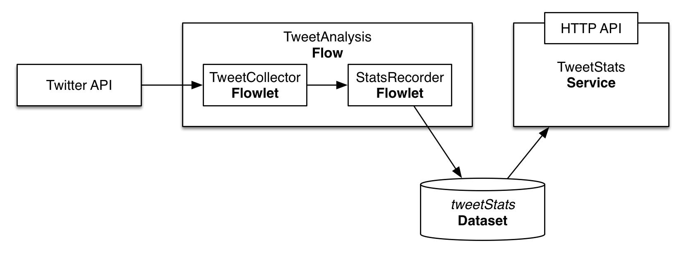

Consuming Twitter Data in Real-time
======================

Consuming live tweets stream in real-time is one of the common tasks of big data applications that power the social 
analytics. In this guide you will learn how to accomplish it with Cask Data Application Platform (CDAP_).

What You Will Build
-------------------

You will build a CDAP application that consumes data from the public twitter feed and computes tweet average size. 
You will:

* Build a a realtime `Flow <http://docs.cask.co/cdap/current/en/dev-guide.html#flows>`__ to process tweets in realtime
* Use a Flowlet from `cdap-pack-twitter <https://github.com/caskdata/cdap-packs>`__ library that uses 
`Twitter4j <http://twitter4j.org/>`__ library to connect Flow and Twitter stream
* Use a `Dataset <http://docs.cask.co/cdap/current/en/dev-guide.html#datasets>`_ to persist analysis results
* Build a `Service <http://docs.cask.co/cdap/current/en/dev-guide.html#services>`_ to serve analysis results via REST

What You Will Need
------------------

* `JDK 6 or JDK 7 <http://www.oracle.com/technetwork/java/javase/downloads/index.html>`_
* `Apache Maven 3.0+ <http://maven.apache.org/>`_
* `CDAP SDK <http://docs.cdap.io/cdap/current/en/getstarted.html#download-and-setup>`_

Let’s Build It!
---------------

Following sections will guide you through building an application from scratch. If you are interested in deploying and
running the application right away, you can clone its source code from this GitHub repository. In that case, feel free
to skip the next two sections and jump right to the `Build and Run`_ section.

Application Design
~~~~~~~~~~~~~~~~~~

Realtime processing capability within CDAP is supported by Flow. The application we build in this guide uses 
Flow for processing the tweets consumed from Twitter feed. The processing results are persisted in a Dataset 
and are made available via HTTP endpoint using Service.

|(AppDesign)|

Flow consists of two processing nodes called Flowlets:

* A collector Flowlet that consumes data from Twitter feed and output a synthesized Tweet object
* An analyzer Flowlet that consumes the Tweet emitted by the collector to update basic statistics of Tweets: 
  total tweets size and count.

Application Implementation
~~~~~~~~~~~~~~~~~~~~~~~~~~

License
=======

Copyright © 2014 Cask Data, Inc.

Licensed under the Apache License, Version 2.0 (the "License"); you may not use this file except
in compliance with the License. You may obtain a copy of the License at

  http://www.apache.org/licenses/LICENSE-2.0

Unless required by applicable law or agreed to in writing, software distributed under the License
is distributed on an "AS IS" BASIS, WITHOUT WARRANTIES OR CONDITIONS OF ANY KIND, either express
or implied. See the License for the specific language governing permissions and limitations under
the License. 

.. _CDAP: http://cdap.io

